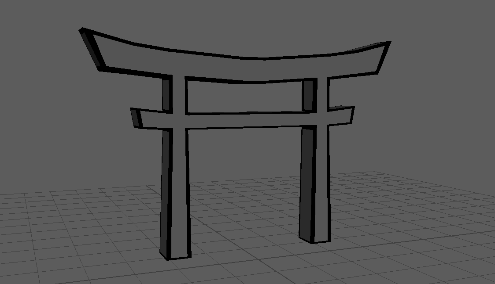
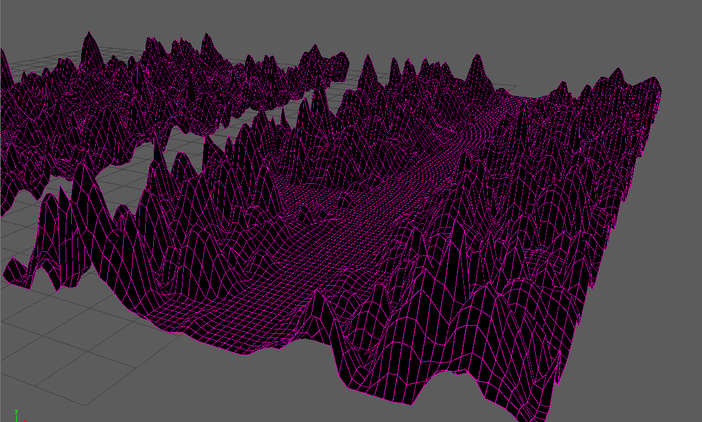
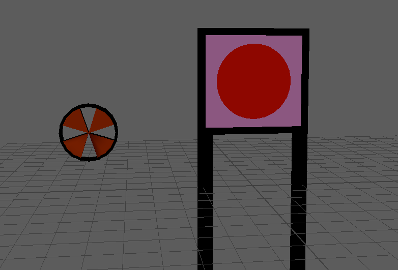

# Journal d'Érick

- [Semaine 1](#semaine-1)
- [Semaine 2](#semaine-2)
- [Semaine 3](#semaine-3)
- [Semaine 4](#semaine-4)
- [Semaine 5](#semaine-5)
- [Semaine de rattrapage](#semaine-de-rattrapage)
- [Semaine 6](#semaine-6)
- [Semaine 7](#semaine-7)
- [Semaine 8](#semaine-8)
- [Semaine 9](#semaine-9)

## Semaine 1

### Résumé des réalisations effectuées

J'ai créé un moodboard pour démontrer l'univers visuel et le style visuel des des modèles 3d.

### Image d'une réalisation dont tu es la ou le plus fier

### Est-ce que j'ai accompli l'ensemble des tâches et objectifs que je m'étais fixés pour cette semaine?

- [ ] Complètement
- [ ] Assez
- [x] Peu
- [ ] Pas du tout

#### Décrivez pourquoi.

L'équipe a pris un peu de retard car nous avons changé notre projet dans son ensemble complet.

#### S'il y a lieu, qu'allez-vous faire pour remédier à la situation?

Je vais essayer de m'avancer dans mes travaux plus rapidement.

### Mon projet s'est-il réalisé selon l’échéancier prévu?

- [ ] Complètement
- [ ] Assez
- [x] Un peu
- [ ] Pas tout à fait

#### S'il y a des écarts, décrivez-les.

#### S'il y a lieu, qu'allez-vous faire pour remédier à la situation?

### Défis pour la prochaine semaine

Commencer à modéliser des arbres ou d'autres éléments 3d.

---

## Semaine 2

### Résumé des réalisations effectuées

Cette semaine, nous avons dû changer notre plan du projet pour que le projet soit plus réalisable. Donc j'ai dû refaire des moodboards qui démontre mieux le style visuel, un style sonore et comment l'interaction marche.

### Image d'une réalisation dont tu es la ou le plus fier

### Est-ce que j'ai accompli l'ensemble des tâches et objectifs que je m'étais fixés pour cette semaine?

- [ ] Complètement
- [ ] Assez
- [ ] Peu
- [x] Pas du tout

#### Décrivez pourquoi.

Nous avons malheureusement dû changer nos inspirations visuelles donc j'ai dû refaire un moodboard ce qui m'a empêché de m'avancer dans la modélisation

#### S'il y a lieu, qu'allez-vous faire pour remédier à la situation?

Je vais commencer à modéliser quand j'aurai fini d'établir le style visuel

### Mon projet s'est-il réalisé selon l’échéancier prévu?

- [ ] Complètement
- [ ] Assez
- [ ] Un peu
- [ ] Pas tout à fait

#### S'il y a des écarts, décrivez-les.

#### S'il y a lieu, qu'allez-vous faire pour remédier à la situation?

### Défis pour la prochaine semaine

Commencer les médias 3d

---

## Semaine 3

### Résumé des réalisations effectuées

Cette semaine j'ai créé le sol en 3d du projet oû les obstacles vont être placés et aussi la plateforme de l'avatar.

### Image d'une réalisation dont tu es la ou le plus fier

### Est-ce que j'ai accompli l'ensemble des tâches et objectifs que je m'étais fixés pour cette semaine?

- [ ] Complètement
- [x] Assez
- [ ] Peu
- [ ] Pas du tout

#### Décrivez pourquoi.

#### S'il y a lieu, qu'allez-vous faire pour remédier à la situation?

### Mon projet s'est-il réalisé selon l’échéancier prévu?

- [ ] Complètement
- [x] Assez
- [ ] Un peu
- [ ] Pas tout à fait

#### S'il y a des écarts, décrivez-les.

#### S'il y a lieu, qu'allez-vous faire pour remédier à la situation?

### Défis pour la prochaine semaine

---

## Semaine 4

### Résumé des réalisations effectuées

Cette semaine, j'ai modéliser une porte Torii, qui provient de l'Architecture Japonaise pour apporter du décor et du style au projet. J'ai aussi modéliser des exemples d'obstacles à intégrer dans notre scène Unity.

### Image d'une réalisation dont tu es la ou le plus fier

### Est-ce que j'ai accompli l'ensemble des tâches et objectifs que je m'étais fixés pour cette semaine?

- [ ] Complètement
- [x] Assez
- [ ] Peu
- [ ] Pas du tout

#### Décrivez pourquoi.

J'ai créé assez de médias 3D pour la maquette.

#### S'il y a lieu, qu'allez-vous faire pour remédier à la situation?

### Mon projet s'est-il réalisé selon l’échéancier prévu?

- [ ] Complètement
- [ ] Assez
- [ ] Un peu
- [ ] Pas tout à fait

#### S'il y a des écarts, décrivez-les.

#### S'il y a lieu, qu'allez-vous faire pour remédier à la situation?

### Défis pour la prochaine semaine

## S'assurer que les médias 3D marchent avec l'univers

## Semaine 5

### Résumé des réalisations effectuées

Dans la semaine 5, j'ai commencé à créer un avatar pour remplacer notre ancien modèle dans notre scène unity.

### Image d'une réalisation dont tu es la ou le plus fier

### Est-ce que j'ai accompli l'ensemble des tâches et objectifs que je m'étais fixés pour cette semaine?

- [ ] Complètement
- [x] Assez
- [ ] Peu
- [ ] Pas du tout

#### Décrivez pourquoi.

J'ai fini mon modèle de l'avatar et maintenant il est prêt pour son squelette et son exportation.

#### S'il y a lieu, qu'allez-vous faire pour remédier à la situation?

### Mon projet s'est-il réalisé selon l’échéancier prévu?

- [ ] Complètement
- [ ] Assez
- [ ] Un peu
- [ ] Pas tout à fait

#### S'il y a des écarts, décrivez-les.

#### S'il y a lieu, qu'allez-vous faire pour remédier à la situation?

### Défis pour la prochaine semaine

## Faire le skinning et le rig et un background visuel. Aussi des obstacles.

## Semaine 6

### Résumé des réalisations effectuées

Dans cette semaine, j'ai non seulement fini mon personnage pour la kinect, mais j'ai aussi terminé les obstacles que j'avais commencé et le background visuel du projet.

### Image d'une réalisation dont tu es la ou le plus fier

### Est-ce que j'ai accompli l'ensemble des tâches et objectifs que je m'étais fixés pour cette semaine?

- [ ] Complètement
- [x] Assez
- [ ] Peu
- [ ] Pas du tout

#### Décrivez pourquoi.

Tout est bien sauf pour l'avatar, l'exportation de ce dernier ne marche pas bien et je n'ai pas trouvé comment régler cela.

#### S'il y a lieu, qu'allez-vous faire pour remédier à la situation?

Pendant la semaine de relâche, un des mes coéquipiers va essayer de l'exporter lui-même.

### Mon projet s'est-il réalisé selon l’échéancier prévu?

- [ ] Complètement
- [ ] Assez
- [ ] Un peu
- [ ] Pas tout à fait

#### S'il y a des écarts, décrivez-les.

#### S'il y a lieu, qu'allez-vous faire pour remédier à la situation?

### Défis pour la prochaine semaine

---

## Semaine de rattrapage

### Résumé des réalisations effectuées

Cette semaine, j'ai refait le squelette de mon personnage car il y avait des problèmes avec le mouvement des parties du corps. Un de ces problèmes était le mouvement du bras du personnage qui affectait une autre partie du corps.

### Image d'une réalisation dont tu es la ou le plus fier

### Est-ce que j'ai accompli l'ensemble des tâches et objectifs que je m'étais fixés pour cette semaine?

- [x] Complètement
- [ ] Assez
- [ ] Peu
- [ ] Pas du tout

#### Décrivez pourquoi.

J'ai refait le skinning du personnage en infrarouge pour enlever les problèmes.

#### S'il y a lieu, qu'allez-vous faire pour remédier à la situation?

### Mon projet s'est-il réalisé selon l’échéancier prévu?

- [ ] Complètement
- [ ] Assez
- [ ] Un peu
- [ ] Pas tout à fait

#### S'il y a des écarts, décrivez-les.

#### S'il y a lieu, qu'allez-vous faire pour remédier à la situation?

### Défis pour la prochaine semaine

---

## Semaine 7

### Résumé des réalisations effectuées

Cette semaine j'ai modifié les lanternes qu'on utilisait en tant que vies car certaines personnes ne comprenaient pas que c'étaient des vies. J'ai rajouté des coeurs sur les lanternes pour rendre cela plus clair.

### Image d'une réalisation dont tu es la ou le plus fier

### Est-ce que j'ai accompli l'ensemble des tâches et objectifs que je m'étais fixés pour cette semaine?

- [x] Complètement
- [ ] Assez
- [ ] Peu
- [ ] Pas du tout

#### Décrivez pourquoi.

#### S'il y a lieu, qu'allez-vous faire pour remédier à la situation?

### Mon projet s'est-il réalisé selon l’échéancier prévu?

- [x] Complètement
- [ ] Assez
- [ ] Un peu
- [ ] Pas tout à fait

#### S'il y a des écarts, décrivez-les.

#### S'il y a lieu, qu'allez-vous faire pour remédier à la situation?

### Défis pour la prochaine semaine

## Semaine 8

Pour cette semaine, je suis venu pour le vernissage et j'ai aussi surveillé le projet durant le mercredi soir. Vendredi la majorité de mon équipe et moi sommes aller démanteler notre oeuvre et nous sommes partis après moin de 2 heures.

## Semaine 9
