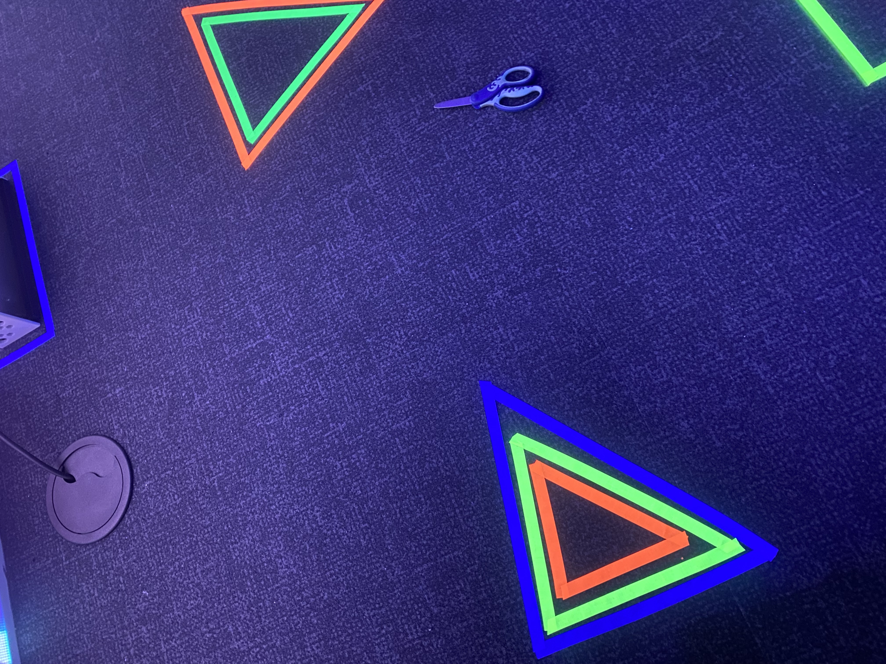

# Journal de "Gabriel Clerval"

* [Semaine 1](#semaine-1)
* [Semaine 2](#semaine-2)
* [Semaine 3](#semaine-3)
* [Semaine 4](#semaine-4)
* [Semaine 5](#semaine-5)
* [Semaine de rattrapage](#semaine-de-rattrapage)
* [Semaine 6](#semaine-6)
* [Semaine 7](#semaine-7)
* [Semaine 8](#semaine-8)
* [Semaine 9](#semaine-9)

## Semaine 1

### Résumé des réalisations effectuées
- Donner des inspirations pour le projet 
- Aide à la correction de quelques détails du projet 
- Début des notes de mon journal personnel 
- Début des recherches pour la création de son

### Image d'une réalisation dont tu es la ou le plus fier

### Est-ce que j'ai accompli l'ensemble des tâches et objectifs que je m'étais fixés pour cette semaine?	
- [ ] Complètement
- [x] Assez
- [ ] Peu
- [ ] Pas du tout

#### Décrivez pourquoi.
Moi et mon équipe avons rattrapé le retard qu'on avait puisque nous avons décidé de nous joindre en une équipe à la place d'avoir plusieurs projets différents.

#### S'il y a lieu, qu'allez-vous faire pour remédier à la situation?
Continuer à s'entraider en équipe pour trouver une solution rapide et  finir le projet dans les temps.

### Mon projet s'est-il réalisé selon l’échéancier prévu?

- [ ] Complètement
- [x] Assez
- [ ] Un peu
- [ ] Pas tout à fait

#### S'il y a des écarts, décrivez-les.
il n'y a pas d'écarts

#### S'il y a lieu, qu'allez-vous faire pour remédier à la situation?
Il n'y a  pas d'écarts donc il n'y a pas besoin de solution à une situation non existante.

### Défis pour la prochaine semaine
Commencer le projet et se familiariser à nouveau avec les logiciels requis pour le projet. 

---
## Semaine 2
### Résumé des réalisations effectuées
J'ai modifié le document de préproduction avec de nouvelles informations à jour tout en ordonnant le document pour qu'il soit propre , j'ai ajouté des inspirations d'idées de projet et complété mon sprint#2 ainsi que le scénarimage.

### Image d'une réalisation dont tu es la ou le plus fier

### Est-ce que j'ai accompli l'ensemble des tâches et objectifs que je m'étais fixés pour cette semaine?

- [ ] Complètement
- [x] Assez
- [ ] Peu
- [ ] Pas du tout

#### Décrivez pourquoi.
J'ai fait tout ce que j'avais à faire dans mon sprint # 2 dans le temps prévu pour  le compléter. 
 

#### S'il y a lieu, qu'allez-vous faire pour remédier à la situation?

### Mon projet s'est-il réalisé selon l’échéancier prévu?

- [ ] Complètement
- [x] Assez
- [ ] Un peu
- [ ] Pas tout à fait

#### S'il y a des écarts, décrivez-les.

#### S'il y a lieu, qu'allez-vous faire pour remédier à la situation?

### Défis pour la prochaine semaine
Commencer les médias sonores pour le projet et aider mon équipe pour faciliter la tâche pendant nos semaines chargées avec n'importe quelle aide possible.

---
## Semaine 3 
### Résumé des réalisations effectuées
Apprentissage de l'application FL Studio pour la création des médias sonores, et première création d'un média sonore pour le projet et correction de l'ancien scénarimage

### Image d'une réalisation dont tu es la ou le plus fier

### Est-ce que j'ai accompli l'ensemble des tâches et objectifs que je m'étais fixés pour cette semaine?

- [ ] Complètement
- [x] Assez
- [ ] Peu
- [ ] Pas du tout

#### Décrivez pourquoi.
Je commence la création des médias pour notre projet avec inspiration du style de vaporwave 
 

#### S'il y a lieu, qu'allez-vous faire pour remédier à la situation?

### Mon projet s'est-il réalisé selon l’échéancier prévu?

- [ ] Complètement
- [x] Assez
- [ ] Un peu
- [ ] Pas tout à fait

#### S'il y a des écarts, décrivez-les.

#### S'il y a lieu, qu'allez-vous faire pour remédier à la situation?

### Défis pour la prochaine semaine
Continuer la création des médias sonores
---
## Semaine 4
### Résumé des réalisations effectuées
Création d'autres médias sonores 

### Image d'une réalisation dont tu es la ou le plus fier

### Est-ce que j'ai accompli l'ensemble des tâches et objectifs que je m'étais fixés pour cette semaine?

- [ ] Complètement
- [ ] Assez
- [x] Peu
- [ ] Pas du tout

#### Décrivez pourquoi.
Ma concentration est maintenant fixée sur la création des effets sonores à la place de la musique

 

#### S'il y a lieu, qu'allez-vous faire pour remédier à la situation?
Commencer directement la création des effets sonores 

### Mon projet s'est-il réalisé selon l’échéancier prévu?

- [ ] Complètement
- [x] Assez
- [ ] Un peu
- [ ] Pas tout à fait

#### S'il y a des écarts, décrivez-les.

#### S'il y a lieu, qu'allez-vous faire pour remédier à la situation?

### Défis pour la prochaine semaine
Finir la création des effets sonores pour lundi 
---
## Semaine 5
### Résumé des réalisations effectuées
J'ai créé plusieurs médias sonores et thèmes musicaux pour notre projet Kigo.J'ai assisté aux problèmes de mon équipe en aidant à régler plusieurs bogues liés au jeu.

### Image d'une réalisation dont tu es la ou le plus fier

### Est-ce que j'ai accompli l'ensemble des tâches et objectifs que je m'étais fixés pour cette semaine?

- [ ] Complètement
- [x] Assez
- [ ] Peu
- [ ] Pas du tout

#### Décrivez pourquoi.
Nous avons maintenant une très bonne base de son qui aide à l'interactivité du joueur dans le jeu, mais il manque quelques effets sonores pour les obstacles.
 

#### S'il y a lieu, qu'allez-vous faire pour remédier à la situation?

### Mon projet s'est-il réalisé selon l’échéancier prévu?

- [x] Complètement
- [ ] Assez
- [ ] Un peu
- [ ] Pas tout à fait

#### S'il y a des écarts, décrivez-les.

#### S'il y a lieu, qu'allez-vous faire pour remédier à la situation?

### Défis pour la prochaine semaine
Faire les effets sonores manquants et continuer à mettre à jour les sons créés pour la satisfaction générale de l'équipe
---
## Semaine de rattrapage
### Résumé des réalisations effectuées
Les effets sonores sont complétés et j'ai aidé à l'installation au grand studio.

### Image d'une réalisation dont tu es la ou le plus fier

### Est-ce que j'ai accompli l'ensemble des tâches et objectifs que je m'étais fixés pour cette semaine?

- [ ] Complètement
- [x] Assez
- [ ] Peu
- [ ] Pas du tout

#### Décrivez pourquoi.
 

#### S'il y a lieu, qu'allez-vous faire pour remédier à la situation?

### Mon projet s'est-il réalisé selon l’échéancier prévu?

- [x] Complètement
- [ ] Assez
- [ ] Un peu
- [ ] Pas tout à fait

#### S'il y a des écarts, décrivez-les.

#### S'il y a lieu, qu'allez-vous faire pour remédier à la situation?

### Défis pour la prochaine semaine
Finir de ranger notre espace pour le grand studio pour la grande ouverture et amélioration des sons et du mixing!

---
## Semaine 6
### Résumé des réalisations effectuées
j'ai mixé le son encore pour que chaque son puisse être entendu et modifier l'effet des sons pour que chaque son soit différent et aidé à cacher les fils de la kinect et de l'ordinateur sous le tapis pour rendre cela plus propre.

### Image d'une réalisation dont tu es la ou le plus fier

### Est-ce que j'ai accompli l'ensemble des tâches et objectifs que je m'étais fixés pour cette semaine?

- [x] Complètement
- [ ] Assez
- [ ] Peu
- [ ] Pas du tout

#### Décrivez pourquoi.
 

#### S'il y a lieu, qu'allez-vous faire pour remédier à la situation?

### Mon projet s'est-il réalisé selon l’échéancier prévu?

- [x] Complètement
- [ ] Assez
- [ ] Un peu
- [ ] Pas tout à fait

#### S'il y a des écarts, décrivez-les.

#### S'il y a lieu, qu'allez-vous faire pour remédier à la situation?

### Défis pour la prochaine semaine

---
## Semaine 7
### Résumé des réalisations effectuées
Décoration du grand studio pour créer une ambiance néon sur le sol.

### Image d'une réalisation dont tu es la ou le plus fier

### Est-ce que j'ai accompli l'ensemble des tâches et objectifs que je m'étais fixés pour cette semaine?

- [x] Complètement
- [ ] Assez
- [ ] Peu
- [ ] Pas du tout

#### Décrivez pourquoi.
 

#### S'il y a lieu, qu'allez-vous faire pour remédier à la situation?

### Mon projet s'est-il réalisé selon l’échéancier prévu?

- [x] Complètement
- [ ] Assez
- [ ] Un peu
- [ ] Pas tout à fait

#### S'il y a des écarts, décrivez-les.

#### S'il y a lieu, qu'allez-vous faire pour remédier à la situation?

### Défis pour la prochaine semaine
cacher  l'ordinateur  et les chaises avant la grande ouverture 

## Semaine 8

## Semaine 9
