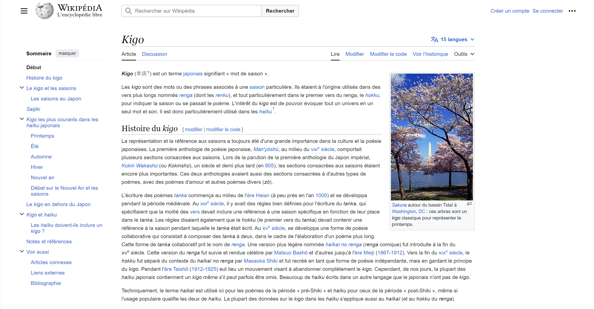
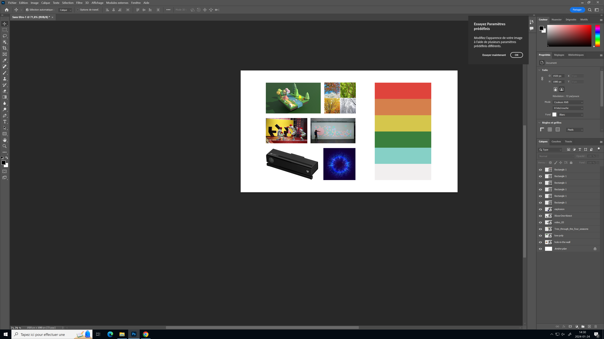

# Journal de Nicolas St-martin

* [Semaine 1](#semaine-1)
* [Semaine 2](#semaine-2)
* [Semaine 3](#semaine-3)
* [Semaine 4](#semaine-4)
* [Semaine 5](#semaine-5)
* [Semaine de rattrapage](#semaine-de-rattrapage)
* [Semaine 6](#semaine-6)
* [Semaine 7](#semaine-7)
* [Semaine 8](#semaine-8)
* [Semaine 9](#semaine-9)

## Semaine 1

### Résumé des réalisations effectuées
- Recherche d'un nom de projet spécial et intéressant qui corespond au projet. 
- Réalisation d'un Moodboard Général du projet.

### Image d'une ou plusieurs réalisation dont je suis le plus fier

ou

### Est-ce que j'ai accompli l'ensemble des tâches et objectifs que je m'étais fixés pour cette semaine?	
- [x] Complètement
- [ ] Assez
- [ ] Peu
- [ ] Pas du tout

#### Décrivez pourquoi.
J'ai trouver une super idée de nom de projet qui plait à tout le monde et qui rajoute une profondeur suplémentaire au projet.

#### S'il y a lieu, qu'allez-vous faire pour remédier à la situation?
aucun

### Mon projet s'est-il réalisé selon l’échéancier prévu?

- [ ] Complètement
- [x] Assez
- [ ] Un peu
- [ ] Pas tout à fait

#### S'il y a des écarts, décrivez-les.
aucun

#### S'il y a lieu, qu'allez-vous faire pour remédier à la situation?
aucun

### Défis pour la prochaine semaine
Terminer la préproduction à 100%.

---
## Semaine 2
### Résumé des réalisations effectuées

### Image d'une réalisation dont tu es la ou le plus fier

### Est-ce que j'ai accompli l'ensemble des tâches et objectifs que je m'étais fixés pour cette semaine?

- [ ] Complètement
- [ ] Assez
- [ ] Peu
- [ ] Pas du tout

#### Décrivez pourquoi.
 

#### S'il y a lieu, qu'allez-vous faire pour remédier à la situation?

### Mon projet s'est-il réalisé selon l’échéancier prévu?

- [ ] Complètement
- [ ] Assez
- [ ] Un peu
- [ ] Pas tout à fait

#### S'il y a des écarts, décrivez-les.

#### S'il y a lieu, qu'allez-vous faire pour remédier à la situation?

### Défis pour la prochaine semaine

---
## Semaine 3 
### Résumé des réalisations effectuées

### Image d'une réalisation dont tu es la ou le plus fier

### Est-ce que j'ai accompli l'ensemble des tâches et objectifs que je m'étais fixés pour cette semaine?

- [ ] Complètement
- [ ] Assez
- [ ] Peu
- [ ] Pas du tout

#### Décrivez pourquoi.
 

#### S'il y a lieu, qu'allez-vous faire pour remédier à la situation?

### Mon projet s'est-il réalisé selon l’échéancier prévu?

- [ ] Complètement
- [ ] Assez
- [ ] Un peu
- [ ] Pas tout à fait

#### S'il y a des écarts, décrivez-les.

#### S'il y a lieu, qu'allez-vous faire pour remédier à la situation?

### Défis pour la prochaine semaine

---
## Semaine 4
### Résumé des réalisations effectuées

### Image d'une réalisation dont tu es la ou le plus fier

### Est-ce que j'ai accompli l'ensemble des tâches et objectifs que je m'étais fixés pour cette semaine?

- [ ] Complètement
- [ ] Assez
- [ ] Peu
- [ ] Pas du tout

#### Décrivez pourquoi.
 

#### S'il y a lieu, qu'allez-vous faire pour remédier à la situation?

### Mon projet s'est-il réalisé selon l’échéancier prévu?

- [ ] Complètement
- [ ] Assez
- [ ] Un peu
- [ ] Pas tout à fait

#### S'il y a des écarts, décrivez-les.

#### S'il y a lieu, qu'allez-vous faire pour remédier à la situation?

### Défis pour la prochaine semaine

---
## Semaine 5
### Résumé des réalisations effectuées

### Image d'une réalisation dont tu es la ou le plus fier

### Est-ce que j'ai accompli l'ensemble des tâches et objectifs que je m'étais fixés pour cette semaine?

- [ ] Complètement
- [ ] Assez
- [ ] Peu
- [ ] Pas du tout

#### Décrivez pourquoi.
 

#### S'il y a lieu, qu'allez-vous faire pour remédier à la situation?

### Mon projet s'est-il réalisé selon l’échéancier prévu?

- [ ] Complètement
- [ ] Assez
- [ ] Un peu
- [ ] Pas tout à fait

#### S'il y a des écarts, décrivez-les.

#### S'il y a lieu, qu'allez-vous faire pour remédier à la situation?

### Défis pour la prochaine semaine

---
## Semaine de rattrapage
### Résumé des réalisations effectuées

### Image d'une réalisation dont tu es la ou le plus fier

### Est-ce que j'ai accompli l'ensemble des tâches et objectifs que je m'étais fixés pour cette semaine?

- [ ] Complètement
- [ ] Assez
- [ ] Peu
- [ ] Pas du tout

#### Décrivez pourquoi.
 

#### S'il y a lieu, qu'allez-vous faire pour remédier à la situation?

### Mon projet s'est-il réalisé selon l’échéancier prévu?

- [ ] Complètement
- [ ] Assez
- [ ] Un peu
- [ ] Pas tout à fait

#### S'il y a des écarts, décrivez-les.

#### S'il y a lieu, qu'allez-vous faire pour remédier à la situation?

### Défis pour la prochaine semaine

---
## Semaine 6
### Résumé des réalisations effectuées

### Image d'une réalisation dont tu es la ou le plus fier

### Est-ce que j'ai accompli l'ensemble des tâches et objectifs que je m'étais fixés pour cette semaine?

- [ ] Complètement
- [ ] Assez
- [ ] Peu
- [ ] Pas du tout

#### Décrivez pourquoi.
 

#### S'il y a lieu, qu'allez-vous faire pour remédier à la situation?

### Mon projet s'est-il réalisé selon l’échéancier prévu?

- [ ] Complètement
- [ ] Assez
- [ ] Un peu
- [ ] Pas tout à fait

#### S'il y a des écarts, décrivez-les.

#### S'il y a lieu, qu'allez-vous faire pour remédier à la situation?

### Défis pour la prochaine semaine

---
## Semaine 7
### Résumé des réalisations effectuées

### Image d'une réalisation dont tu es la ou le plus fier

### Est-ce que j'ai accompli l'ensemble des tâches et objectifs que je m'étais fixés pour cette semaine?

- [ ] Complètement
- [ ] Assez
- [ ] Peu
- [ ] Pas du tout

#### Décrivez pourquoi.
 

#### S'il y a lieu, qu'allez-vous faire pour remédier à la situation?

### Mon projet s'est-il réalisé selon l’échéancier prévu?

- [ ] Complètement
- [ ] Assez
- [ ] Un peu
- [ ] Pas tout à fait

#### S'il y a des écarts, décrivez-les.

#### S'il y a lieu, qu'allez-vous faire pour remédier à la situation?

### Défis pour la prochaine semaine

## Semaine 8

## Semaine 9
