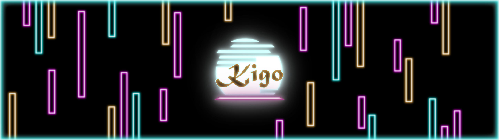
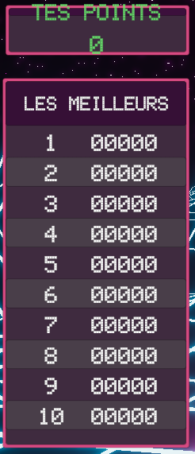

# Journal de Nicolas St-martin

* [Semaine 1](#semaine-1)
* [Semaine 2](#semaine-2)
* [Semaine 3](#semaine-3)
* [Semaine 4](#semaine-4)
* [Semaine 5](#semaine-5)
* [Semaine de rattrapage](#semaine-de-rattrapage)
* [Semaine 6](#semaine-6)
* [Semaine 7](#semaine-7)
* [Semaine 8](#semaine-8)
* [Semaine 9](#semaine-9)

## Semaine 1  
### Résumé des réalisations effectuées  
- Recherche d'un nom de projet spécial et intéressant qui correspond au projet.
- Réalisation d'un Moodboard Général du projet.

### Image d'une ou plusieurs réalisation dont je suis le plus fier  

### Est-ce que j'ai accompli l'ensemble des tâches et objectifs que je m'étais fixés pour cette semaine?  
- [x] Complètement
- [ ] Assez
- [ ] Peu
- [ ] Pas du tout

#### Décrivez pourquoi.  
J'ai trouvé une super idée de nom de projet qui plaît à tout le monde et qui rajoute une profondeur supplémentaire au projet.

#### S'il y a lieu, qu'allez-vous faire pour remédier à la situation?  

### Mon projet s'est-il réalisé selon l’échéancier prévu?  
- [ ] Complètement
- [x] Assez
- [ ] Un peu
- [ ] Pas tout à fait

#### S'il y a des écarts, décrivez-les.  

#### S'il y a lieu, qu'allez-vous faire pour remédier à la situation?  

### Défis pour la prochaine semaine  
Terminer la préproduction à 100%.

---  
## Semaine 2  
### Résumé des réalisations effectuées  
- Conception d'un logo pour notre projet Kigo.
- Réalisation d'un prototype fonctionnel de notre jeu.

### Image d'une réalisation dont tu es la ou le plus fier  

### Est-ce que j'ai accompli l'ensemble des tâches et objectifs que je m'étais fixés pour cette semaine?  
- [ ] Complètement
- [x] Assez
- [ ] Peu
- [ ] Pas du tout

#### Décrivez pourquoi.  
Le prototypes fonctionnent bien mais il peut encore être amélioré pour rendre l'expérience encore meilleur.

#### S'il y a lieu, qu'allez-vous faire pour remédier à la situation?  

### Mon projet s'est-il réalisé selon l’échéancier prévu?  
- [x] Complètement
- [ ] Assez
- [ ] Un peu
- [ ] Pas tout à fait

#### S'il y a des écarts, décrivez-les.  

#### S'il y a lieu, qu'allez-vous faire pour remédier à la situation?  

### Défis pour la prochaine semaine  
Améliorer le prototype et faire des essais avec la kinect.

---  
## Semaine 3  
### Résumé des réalisations effectuées  
Amélioration du prototype par l'ajout de fonctionnalitée supplémentaire tel que la génération d'obstacles aléatoire.

### Image d'une réalisation dont tu es la ou le plus fier  

### Est-ce que j'ai accompli l'ensemble des tâches et objectifs que je m'étais fixés pour cette semaine?  
- [x] Complètement
- [ ] Assez
- [ ] Peu
- [ ] Pas du tout

#### Décrivez pourquoi.   
J'ai réussi à générer de manière aléatoire des obstacles pour les faire avancer et rentrer en collision avec notre avatar.

#### S'il y a lieu, qu'allez-vous faire pour remédier à la situation?  

### Mon projet s'est-il réalisé selon l’échéancier prévu?  
- [ ] Complètement
- [x] Assez
- [ ] Un peu
- [ ] Pas tout à fait

#### S'il y a des écarts, décrivez-les.  

#### S'il y a lieu, qu'allez-vous faire pour remédier à la situation?  

### Défis pour la prochaine semaine  
Rajouter d'autre fonction dans le jeu comme des bonus et d'autres types d'obstacles.

---  
## Semaine 4  
### Résumé des réalisations effectuées  
- J'ai réalisé une bannière pour notre site.
- J'ai perfectionné le prototype en prévision de la maquette avec different obstacle et un système de pointage.

### Image d'une réalisation dont tu es la ou le plus fier  

### Est-ce que j'ai accompli l'ensemble des tâches et objectifs que je m'étais fixés pour cette semaine?  
- [x] Complètement
- [ ] Assez
- [ ] Peu
- [ ] Pas du tout

#### Décrivez pourquoi.  
J'arrive à générer different prefab selon les probabilités d'apparition que je leur ai données.

#### S'il y a lieu, qu'allez-vous faire pour remédier à la situation?  

### Mon projet s'est-il réalisé selon l’échéancier prévu?  
- [ ] Complètement
- [x] Assez
- [ ] Un peu
- [ ] Pas tout à fait

#### S'il y a des écarts, décrivez-les.  

#### S'il y a lieu, qu'allez-vous faire pour remédier à la situation?  

### Défis pour la prochaine semaine
Commencer l'intégration des assets finaux.

---  
## Semaine 5  
### Résumé des réalisations effectuées  
J'ai réalisé un système d'affichage des 10 meilleurs pointages et j'ai fait des améliorations dans la programmation du jeu.

### Image d'une réalisation dont tu es la ou le plus fier  

### Est-ce que j'ai accompli l'ensemble des tâches et objectifs que je m'étais fixés pour cette semaine?  
- [x] Complètement
- [ ] Assez
- [ ] Peu
- [ ] Pas du tout

#### Décrivez pourquoi.  
Le code est devenu plus propre avec des valeurs bien identifiées et un classement des scores fonctionnels.

#### S'il y a lieu, qu'allez-vous faire pour remédier à la situation?  

### Mon projet s'est-il réalisé selon l’échéancier prévu?  
- [ ] Complètement
- [x] Assez
- [ ] Un peu
- [ ] Pas tout à fait

#### S'il y a des écarts, décrivez-les.  

#### S'il y a lieu, qu'allez-vous faire pour remédier à la situation?  

### Défis pour la prochaine semaine  
Rajouter des effets visuels quand personne ne joue pour inviter le public à approcher et réaliser d'autre ajustement dans le code pour régler des bugs.

---  
## Semaine de rattrapage  
### Résumé des réalisations effectuées  
Réalisation d'un code avec un peu d'aide de Thomas pour que le joueur soit détecté seulement quand il rentre dans la zone de jeu et réalisation d'une petite animation qui invite l'intéracteur à rentrer dans la zone de jeu.

### Image d'une réalisation dont tu es la ou le plus fier  

### Est-ce que j'ai accompli l'ensemble des tâches et objectifs que je m'étais fixés pour cette semaine?  
- [x] Complètement
- [ ] Assez
- [ ] Peu
- [ ] Pas du tout

#### Décrivez pourquoi.  
 La zone de jeu marche très bien, on est mtn capable de voir clairement quand les personnes sortent et rentre dans la zone.

#### S'il y a lieu, qu'allez-vous faire pour remédier à la situation?  

### Mon projet s'est-il réalisé selon l’échéancier prévu?  
- [x] Complètement
- [ ] Assez
- [ ] Un peu
- [ ] Pas tout à fait

#### S'il y a des écarts, décrivez-les.  

#### S'il y a lieu, qu'allez-vous faire pour remédier à la situation?  

### Défis pour la prochaine semaine  
Faire en sorte de déclencher un évènement quand la personne sort du jeu alors que la partie est en cours.

---  
## Semaine 6  
### Résumé des réalisations effectuées  
Réalisation d'un évènement qui survient quand le joueur sort de la zone pendant une partie pour l'inviter à revenir dans la zone dee jeux pour éviter de mourir subitement.

### Image d'une réalisation dont tu es la ou le plus fier  

### Est-ce que j'ai accompli l'ensemble des tâches et objectifs que je m'étais fixés pour cette semaine?  
- [ ] Complètement
- [x] Assez
- [ ] Peu
- [ ] Pas du tout

#### Décrivez pourquoi.  
 Le code peu encore etre ameliorer mais ça marche tout de meme tres biens et sa permet d'arretter le jeux si le joueur quite la zone sans finir ça partie.

#### S'il y a lieu, qu'allez-vous faire pour remédier à la situation?  

### Mon projet s'est-il réalisé selon l’échéancier prévu?  
- [ ] Complètement
- [x] Assez
- [ ] Un peu
- [ ] Pas tout à fait

#### S'il y a des écarts, décrivez-les.  

#### S'il y a lieu, qu'allez-vous faire pour remédier à la situation?  

### Défis pour la prochaine semaine  
Résoudre des bugs et améliorer le code ainsi que l'aspect visuel sur la scène unity.

---  
## Semaine 7  
### Résumé des réalisations effectuées  
Correction de l'aspect visuel final de la scène et amélioration de l'animation des obstacles quand elle quitte la zone de jeu.

### Image d'une réalisation dont tu es la ou le plus fier  

### Est-ce que j'ai accompli l'ensemble des tâches et objectifs que je m'étais fixés pour cette semaine?  
- [x] Complètement
- [ ] Assez
- [ ] Peu
- [ ] Pas du tout

#### Décrivez pourquoi.  
Nous avons réussi à livrer un projet fonctionnel pour la semaine de présentation et je crois que les gens vont adorer même s'il y a peut-être 2-3 aspects qui auraientt pu être améliorés.

#### S'il y a lieu, qu'allez-vous faire pour remédier à la situation?  

### Mon projet s'est-il réalisé selon l’échéancier prévu?  
- [ ] Complètement
- [x] Assez
- [ ] Un peu
- [ ] Pas tout à fait

#### S'il y a des écarts, décrivez-les.  

#### S'il y a lieu, qu'allez-vous faire pour remédier à la situation?  

### Défis pour la prochaine semaine  
Présenter notre magnifique projet au public avec le moins de problème possible.

## Semaine 8  
Nous avons présenté notre projet et les gens ont adoré, nous avons eu plein de bon commentaire et on a répondu à toutes les questions du public.

## Semaine 9  
