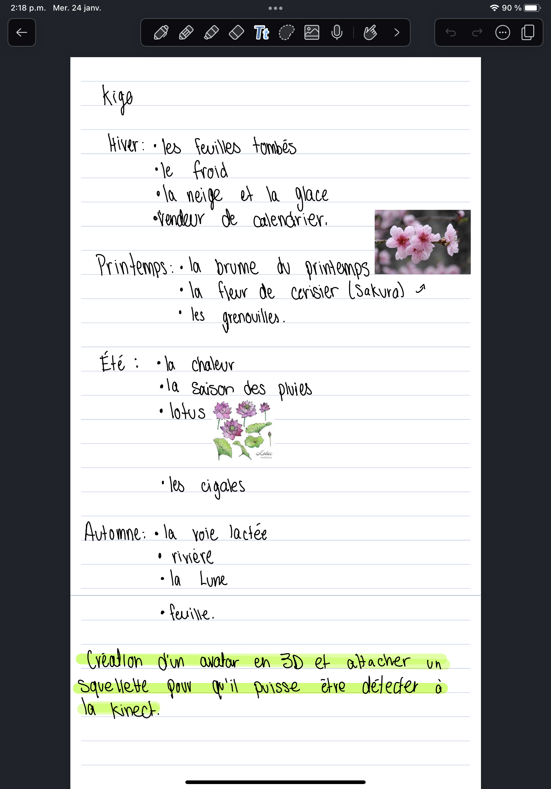
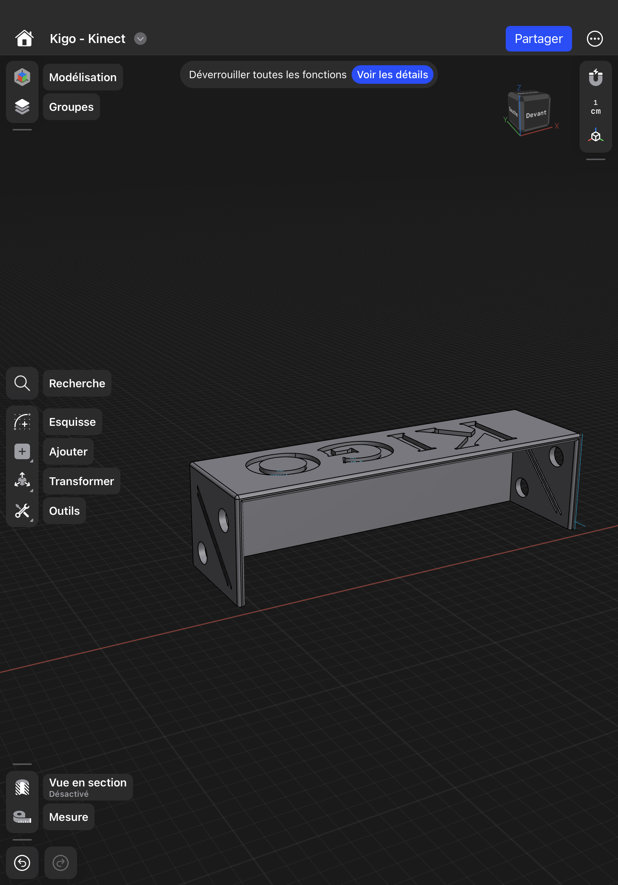

# Journal de William Rathier Mailly

- [Semaine 1](#semaine-1)
- [Semaine 2](#semaine-2)
- [Semaine 3](#semaine-3)
- [Semaine 4](#semaine-4)
- [Semaine 5](#semaine-5)
- [Semaine de rattrapage](#semaine-de-rattrapage)
- [Semaine 6](#semaine-6)
- [Semaine 7](#semaine-7)
- [Semaine 8](#semaine-8)
- [Semaine 9](#semaine-9)

## Semaine 1

### Résumé des réalisations effectuées

- Pour débuter j'ai discuter avec mon équipe sur le but concret du projet.
- nous avons pris des idées de chacun et j'ai pris le temps de les retranscrire par écrit sur mon iPad.
- J'ai essayer de toruver des images qui pouvait nous inspirer pour nos futurs création.
- Les photos ont été mis sur mon dossier écrit.

### Image d'une réalisation dont tu es la ou le plus fier

### Est-ce que j'ai accompli l'ensemble des tâches et objectifs que je m'étais fixés pour cette semaine?

- [x] Complètement
- [ ] Assez
- [ ] Peu
- [ ] Pas du tout

#### Décrivez pourquoi.

Pour une première semaine, je ne vois pas encore de problèmes. Nous avons une bonne communication et je pense que ça va continuer comme cela. Je travail pour que l'équipe ne manque de rien et pour l'instant je réussi très bien.

#### S'il y a lieu, qu'allez-vous faire pour remédier à la situation?

Continuer comme ont le fait déjà.

### Mon projet s'est-il réalisé selon l’échéancier prévu?

- [ ] Complètement
- [x] Assez
- [ ] Un peu
- [ ] Pas tout à fait

#### S'il y a des écarts, décrivez-les.

il n'y a pas de problèmes d'échéance.

#### S'il y a lieu, qu'allez-vous faire pour remédier à la situation?

Continuer comme ont le fait déjà.

### Défis pour la prochaine semaine

Avancer le plus possible le début du projet. Trouver les idées finales et aussi donner des objectifs pour chacun des participants pour pouvoir avancer en équipe et ne pas se retouver avec un membre de l'équipe qui ne fait rien.

---

## Semaine 2

### Résumé des réalisations effectuées
Pour ma part j'ai réalisé beaucoup de recherche pour la programmation de la kinect. Je n'ai pas encore réaliser de programmation complète, par contre j'ai pour déterminer l'espace du jeu ce qui me permet de pouvoir commencer a faire les test de distance de la kinect. Cette semaine ma permis de beaucoup avancer en terme d'espace de la kinect. Aussi, j'ai pris de l'avance et j'ai modéliser une boite de protection de la kinect il me retsera à l'imprimer.

### Image d'une réalisation dont tu es la ou le plus fier

### Est-ce que j'ai accompli l'ensemble des tâches et objectifs que je m'étais fixés pour cette semaine?

- [ ] Complètement
- [x] Assez
- [ ] Peu
- [ ] Pas du tout

#### Décrivez pourquoi.
J'ai fais une grande partie des tâches qui m'étaient attribués, mais par manque de ressources je n'ai pas pus réussir 100% du travail. Je suis quand même fier de ce que j'ai accompli cette semaine j'ai rattrapé du retard.

#### S'il y a lieu, qu'allez-vous faire pour remédier à la situation?
rechercher beaucoup plus de ressources que ce soit par moi ou par mes profs qui sont là pour aider.

### Mon projet s'est-il réalisé selon l’échéancier prévu?

- [ ] Complètement
- [x] Assez
- [ ] Un peu
- [ ] Pas tout à fait

#### S'il y a des écarts, décrivez-les.
je pense que nous sommes encore un peu en retard sur l'échéancier, mais par contre nous avons beaucoup avancer comparer a la semaine dernière.

#### S'il y a lieu, qu'allez-vous faire pour remédier à la situation?
travailler encore très fort et redoubler d'effort pour être a 0% de reatrd.

### Défis pour la prochaine semaine
Finir les test complet de la kinect et commencer un programme.

---

## Semaine 3

### Résumé des réalisations effectuées
Cette semaine j'ai continué à faire de la recherche pour trouver le bon package pour intégrer la kinect vers le logiciel unity. J'ai enfin trouvé un package qui fonctionne donc j'ai les données d'un squellet capter par la kinect dans unity ce qui me rends bien fier.
### Image d'une réalisation dont tu es la ou le plus fier

### Est-ce que j'ai accompli l'ensemble des tâches et objectifs que je m'étais fixés pour cette semaine?

- [ ] Complètement
- [x] Assez
- [ ] Peu
- [ ] Pas du tout

#### Décrivez pourquoi.
J'ai réussi enfin a livrer un squellete 3D dans unity, mais je me satisfais pas encore, car je n'ai pas encore fini a 100% l'histoire de l'avatar.
#### S'il y a lieu, qu'allez-vous faire pour remédier à la situation?
Continuer d'apprendre comment le package fonctionne et trouver les sollutions aux futurs problèmes.
### Mon projet s'est-il réalisé selon l’échéancier prévu?

- [ ] Complètement
- [x] Assez
- [ ] Un peu
- [ ] Pas tout à fait

#### S'il y a des écarts, décrivez-les.
Il y a quelque écarts du au retard que j'avais pris avec l'ancien package qui était trop vieux pour la version de unity que j'avais en ma possession.
#### S'il y a lieu, qu'allez-vous faire pour remédier à la situation?
Redoubler d'effort pour que je puisse livrer un avatar qui fonctionne bien a mon collègue.
### Défis pour la prochaine semaine
Livrer un avatr 3D a mon collègue.
---

## Semaine 4

### Résumé des réalisations effectuées

### Image d'une réalisation dont tu es la ou le plus fier

### Est-ce que j'ai accompli l'ensemble des tâches et objectifs que je m'étais fixés pour cette semaine?

- [ ] Complètement
- [ ] Assez
- [ ] Peu
- [ ] Pas du tout

#### Décrivez pourquoi.

#### S'il y a lieu, qu'allez-vous faire pour remédier à la situation?

### Mon projet s'est-il réalisé selon l’échéancier prévu?

- [ ] Complètement
- [ ] Assez
- [ ] Un peu
- [ ] Pas tout à fait

#### S'il y a des écarts, décrivez-les.

#### S'il y a lieu, qu'allez-vous faire pour remédier à la situation?

### Défis pour la prochaine semaine

---

## Semaine 5

### Résumé des réalisations effectuées

### Image d'une réalisation dont tu es la ou le plus fier

### Est-ce que j'ai accompli l'ensemble des tâches et objectifs que je m'étais fixés pour cette semaine?

- [ ] Complètement
- [ ] Assez
- [ ] Peu
- [ ] Pas du tout

#### Décrivez pourquoi.

#### S'il y a lieu, qu'allez-vous faire pour remédier à la situation?

### Mon projet s'est-il réalisé selon l’échéancier prévu?

- [ ] Complètement
- [ ] Assez
- [ ] Un peu
- [ ] Pas tout à fait

#### S'il y a des écarts, décrivez-les.

#### S'il y a lieu, qu'allez-vous faire pour remédier à la situation?

### Défis pour la prochaine semaine

---

## Semaine de rattrapage

### Résumé des réalisations effectuées

### Image d'une réalisation dont tu es la ou le plus fier

### Est-ce que j'ai accompli l'ensemble des tâches et objectifs que je m'étais fixés pour cette semaine?

- [ ] Complètement
- [ ] Assez
- [ ] Peu
- [ ] Pas du tout

#### Décrivez pourquoi.

#### S'il y a lieu, qu'allez-vous faire pour remédier à la situation?

### Mon projet s'est-il réalisé selon l’échéancier prévu?

- [ ] Complètement
- [ ] Assez
- [ ] Un peu
- [ ] Pas tout à fait

#### S'il y a des écarts, décrivez-les.

#### S'il y a lieu, qu'allez-vous faire pour remédier à la situation?

### Défis pour la prochaine semaine

---

## Semaine 6

### Résumé des réalisations effectuées

### Image d'une réalisation dont tu es la ou le plus fier

### Est-ce que j'ai accompli l'ensemble des tâches et objectifs que je m'étais fixés pour cette semaine?

- [ ] Complètement
- [ ] Assez
- [ ] Peu
- [ ] Pas du tout

#### Décrivez pourquoi.

#### S'il y a lieu, qu'allez-vous faire pour remédier à la situation?

### Mon projet s'est-il réalisé selon l’échéancier prévu?

- [ ] Complètement
- [ ] Assez
- [ ] Un peu
- [ ] Pas tout à fait

#### S'il y a des écarts, décrivez-les.

#### S'il y a lieu, qu'allez-vous faire pour remédier à la situation?

### Défis pour la prochaine semaine

---

## Semaine 7

### Résumé des réalisations effectuées

### Image d'une réalisation dont tu es la ou le plus fier

### Est-ce que j'ai accompli l'ensemble des tâches et objectifs que je m'étais fixés pour cette semaine?

- [ ] Complètement
- [ ] Assez
- [ ] Peu
- [ ] Pas du tout

#### Décrivez pourquoi.

#### S'il y a lieu, qu'allez-vous faire pour remédier à la situation?

### Mon projet s'est-il réalisé selon l’échéancier prévu?

- [ ] Complètement
- [ ] Assez
- [ ] Un peu
- [ ] Pas tout à fait

#### S'il y a des écarts, décrivez-les.

#### S'il y a lieu, qu'allez-vous faire pour remédier à la situation?

### Défis pour la prochaine semaine

## Semaine 8

## Semaine 9
