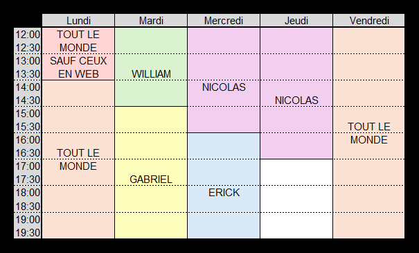
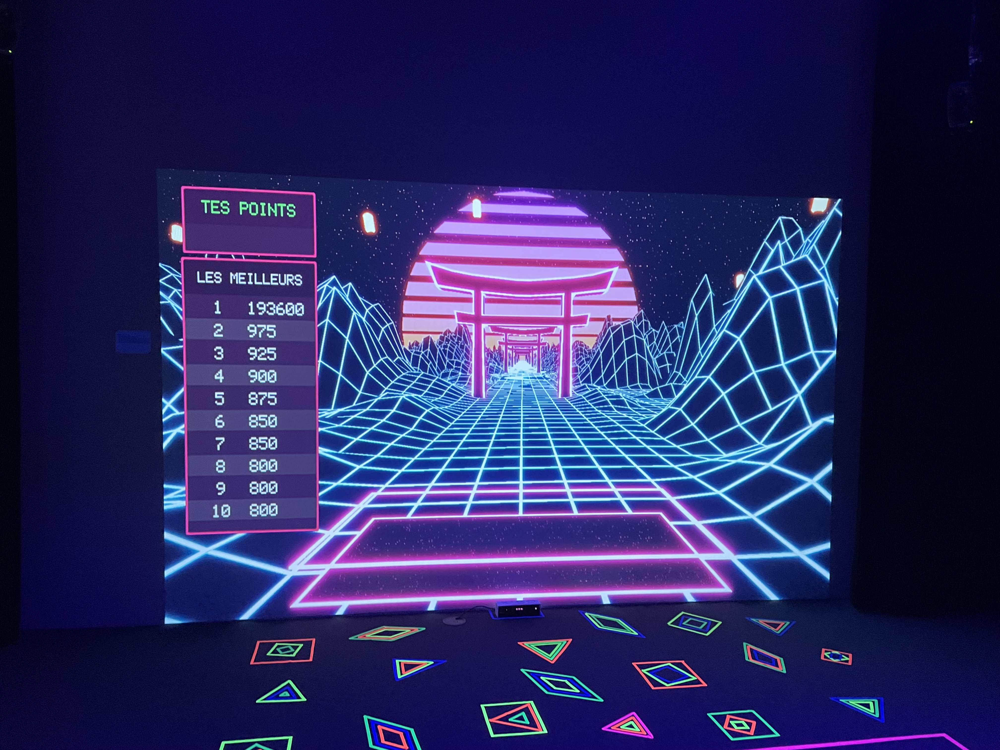
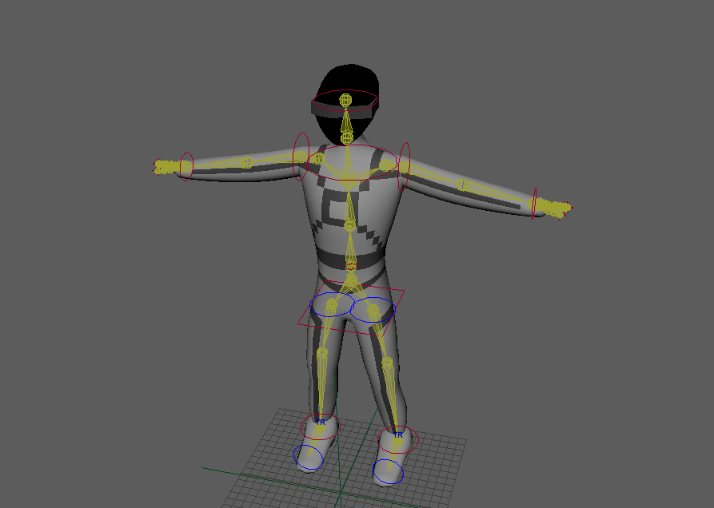
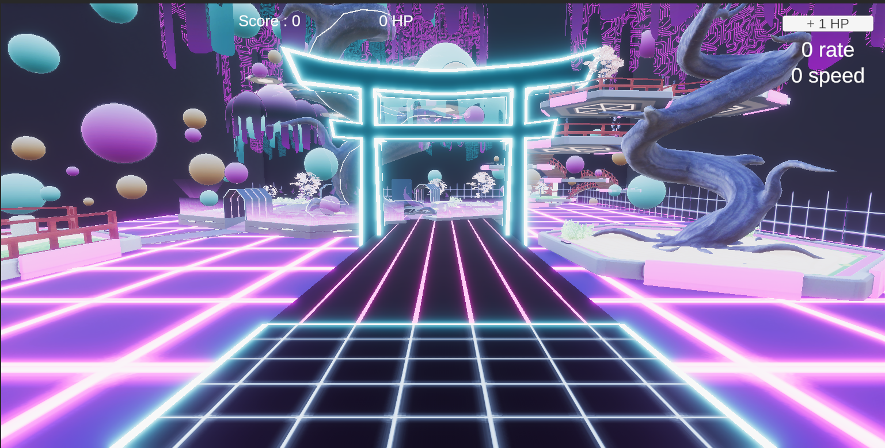
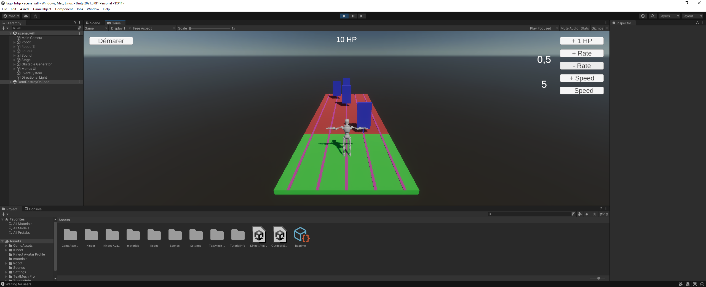
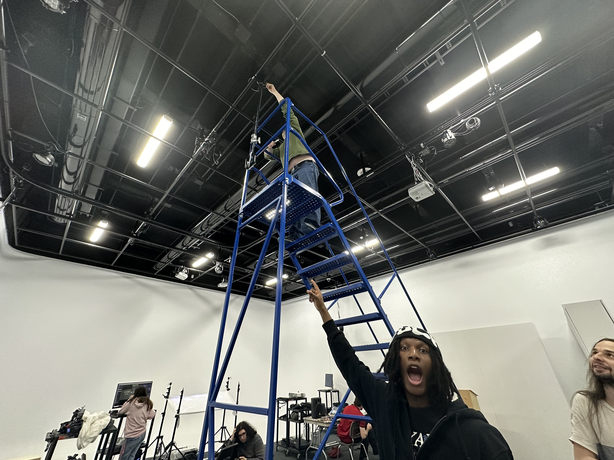
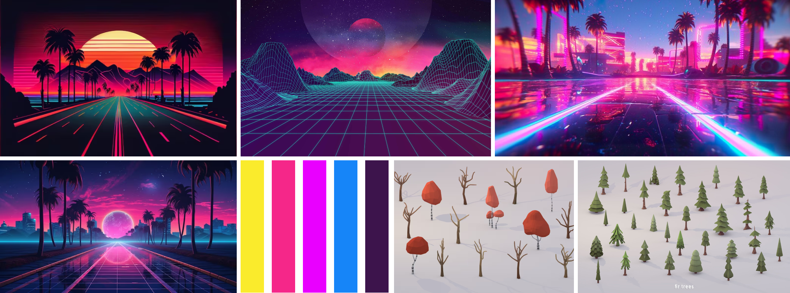
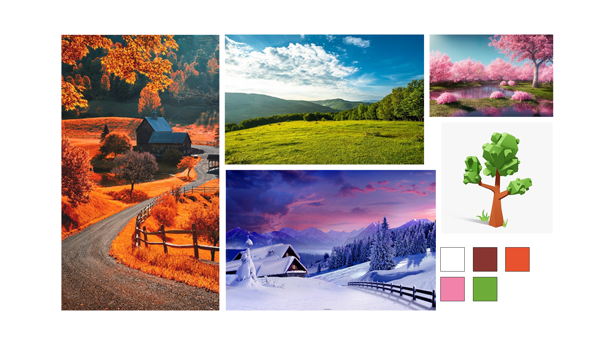

# Journal de création

## Semaine 9
Cette semaine, c'était la présentation des projets au publique donc nous sommes venu au vernissage et Nicolas a créer une liste pour savoir quand chaque personne venait surveiller le projet. Le jeu était populaire.

https://youtu.be/9KOZzKAHbGE?si=8gTTbiFdBPkQEXho

## Semaine 8
Dans cette semaine, nous avons finaliser le projet en rajoutant un ciel étoilé et un soleil final. Nous avons aussi rajouter des formes avec du ruban adhésif multicouleurs sur la zone de jeu. Les proffesseurs nous ont aussi pointé vers un problème de spatialisation du son que Gabriel Clerval a réglé.

## Semaine 7
Durant cette semaine, nous avons travailler pour finaliser l'avatar car il restait des problèmes de skinning et de rigging à corriger

## Semaine 6
Cette semaine, nous avons commencé la production des effets visuels et sonores finaux. Et aussi des réglages de bugs.

## Semaine 5

La maquette est déployé et les premières années sont venus l'essayer.

## Semaine 4

Le gros de la maquette est fonctionelle prête à être déployé.

## Semaine 3

L'équipe a presque finaliser l'installation dans le grand studio. Le projecteur, la kinect et les hauts-parleurs sont en place.

## Semaine 2

Notre équipe a trouver le thèmes principal du projet suite à de nombreuses discussion. Nous avons défini le thème du projet qui est le rétro néon.

## Semaine 1

Notre équipe a travaillé à finaliser la préproduction, car notre projet a beaucoup changé.
La conception de moodboard a aidé à conceptualiser l'idée du projet.

Les problèmes rencontrés seraient malheureusement le temps et le trop pleins d'idées en si peu de temps. Or, nous avions beaucoup d'idées et c'était difficile de choisir parmi nos choix. Ce qui nous retardait sur les autres travaux que nous devions faire.

Pour finir la semaine 1, Thomas nous a demandé un devoir que nous avons réalisé vendredi en appel teams.
