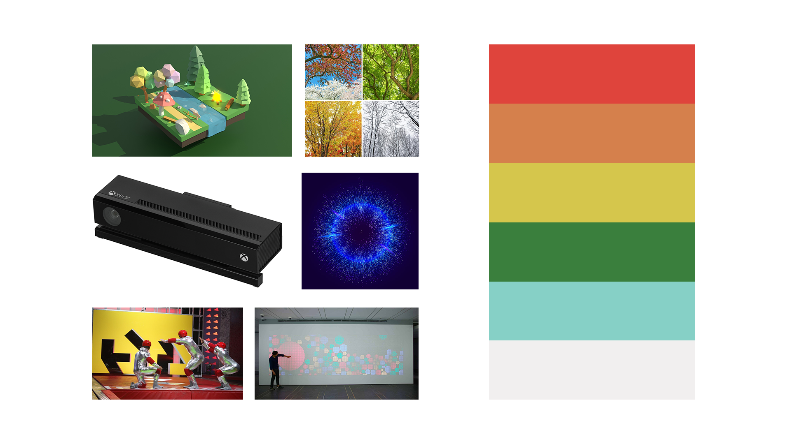
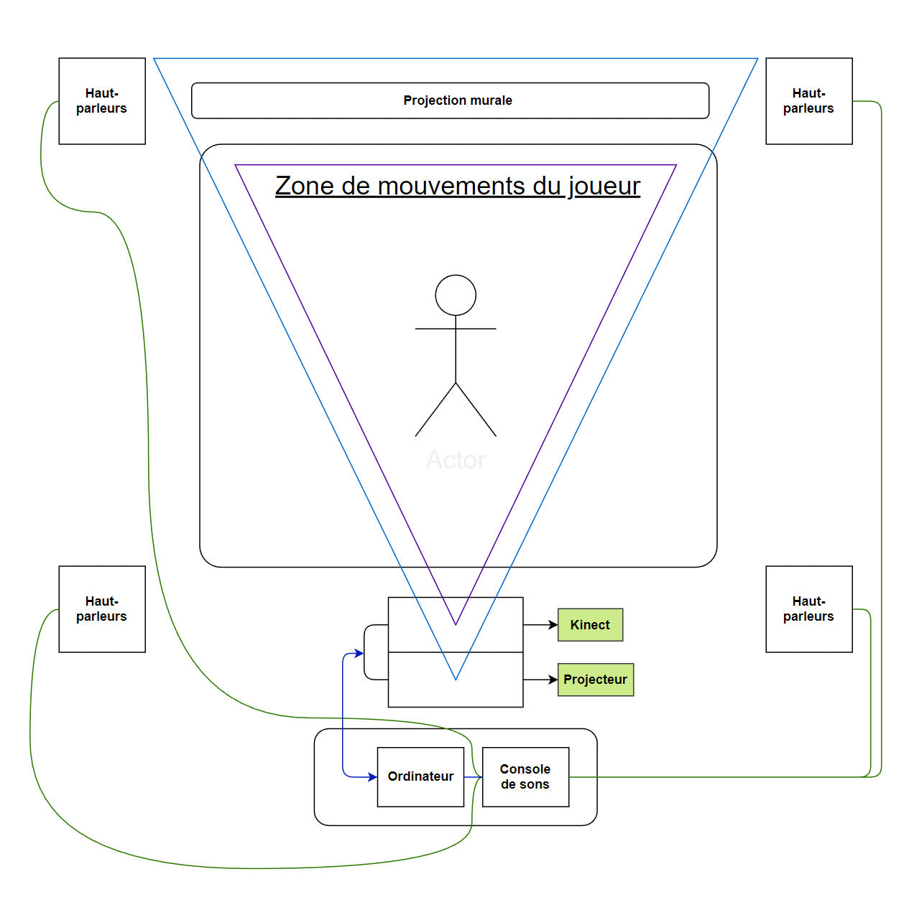

# Preproduction espace interactif

## Intention du concept

Démontrer le passage des saisons par un jeu interactif dont les saisons représentent un niveau de difficulté graduelle.

### Synopsis

Dans le cadre du cours, notre équipe présente une expérience multimédia interactice. Cette expérience prendra la forme d'un jeu Kigo qui représente les saisons. 
Le but de cette expérience sera de compléter de 4 niveaux de difficultés allant de facile à très difficile. Les décors représenteront les 4 saisons et dont chacune représentera un niveau ainsi que sa difficulté.

### Cartographie

### Intention de départ

> En temps qu'équipe, notre intention de départ était de faire une expérience multimédia interactive par l'entremise d'un jeu interactif. Ce projet est une occasion de démontrer aux professeurs, au public l'étendue des connaissances acquises durant la technique d'Intégration Multimédia et de leurs applications dans le cadre du projet final de la technique.

### Moodboard

Général

  

Visuel artistique

Sonore

[Ambiance niveau printemps](https://youtu.be/UZ9uyQI3pF0?si=OWN5xIRoZ-BNiwXK&t=1264)

[Ambiance niveau été](https://youtu.be/kW10Xx_Hdto?si=54hkybJjyr6JJFpp&t=2894)

[Ambiance niveau automne](https://youtu.be/aT66uumZ0Zo?si=jfz0KRhrSTcqDlvQ)

[Ambiance niveau hiver](https://youtu.be/5_NgwbEs4JE?si=0kg9LaFzikDOZQNH&t=9474)

### Références

[Références|Fit it sur steam](https://store.steampowered.com/app/951450/Fit_It/)

[Références|Hole in the Wall](https://www.youtube.com/watch?v=7oIag7dTup0)

[Références|Resident Evil 4 Target Practice inspiration](https://www.youtube.com/watch?v=dxOleXVO4lw&t=44s)

### Documents

### Scénarimages

### Schéma de Plantation
  

## Contenu multimédia à intégrer

- Des paysages différents pour chaque saison.
- Des sons d'ambiances pour chaque saison
- Musique (optionnelle)

### Inventaire du contenu multimédia

| Actions du joueur  |Son reliés à L'action |
| ------------- | ------------- |
| Déplacement à droite ou  à gauche  | *son à décider*  |
| Sauter | *son à décider*  |

### Univers artistique des éléments

## Planification technique d'un prototype

### Plans technique

### Matériaux requis

- Kinect V2
- Projecteur
- Ordinateur portable Windows
- Extension électrique
- Fils Ethernet (Pour s'assurer d'une bonne connexion internet)
- Tapis de protection
- Litepanel
- Safety en métal
- Sac de sables de 15 lbs
- Superclamp Manfrotto 035
- HDMI Extender
- Powerbar
- Chariot Ordinateur
- Câbles HDMI
- Console de son
- Câble d’alimentation pour ordinateur
- Câble d’alimentation pour console de son
- Câble d’alimentation pour projecteur
- Câble displayPort
- Câble XLR
- Powercon
- Extensions fil électrique
- Magic arm
- Genelec 8010APM

### Logiciels requis

- [Max](https://cycling74.com/downloads)
- [Kinect studio](https://github.com/Kinect/Docs/blob/master/Kinect4Windows2.0/k4w2/NUI_Tools/Kinect_Studio.md)
- [Unity](https://unity.com/fr)
- [Touch designer](https://derivative.ca/) (Si Unity ne marche pas)
- [Blender](https://www.blender.org/) ou [Maya](https://www.autodesk.com/ca-fr/products/maya/free-trial)
- [OBS Studio](https://obsproject.com/fr)
- [Reaper](https://www.reaper.fm/)

### Ressources humaines requises

- TTP, location des matériaux
- Les membres de l'équipe pour l'installation des projets
- Les participants (le public)
- Guillaume Arsenault
- Thomas Ouellet Fredericks

### Ressources spatiales requise

- Grand Studio
- Captation vidéo
- Projection vidéo sur un mur
- Installation et usage de hauts-paleurs
- Une table
- Un trépied pouvant supporter la kinect
- Un espace pour permettre de mettre des hauts-parleurs

### Contraintes techniques et potentiels problèmes de production

- Avoir des instructions claires pour les participants pour démarrer l'immersion de chaque projet sans l'aide des créateurs du projets.
- Avoir un projet fonctionel sans avoir besoin de la présence des créateurs du projet
- Mettre en place une manière simple et efficace de pouvoir garder les équipements nécessaires pour les projets chargés et prêts à l'utilisation.
- Cable des projets qui pourrait être sur le chemin du public

## Planification de la production d'un prototype (budget et étapes de réalisation)

### Budget prévisionnel

- Achat de logiciels pour le travail à la maison au besoin
- Tout les matériaux pour constuire l'espace nécessaire et les différents projets

### Échéancier global

#### Dates importantes

- Conception et planification : Lundi de la semaine 3
- Maquette(Présentation) : Lundi de la semaine 5
- Documentation(Mise en ligne) : Lundi au vendredi de la semaine 8
- Réalisation et diffusion d'une expérience interactice : Du lundi au vendredi de la semaine 8

### Liste des tâches à réaliser

#### Antoine Dion

- Location des matériaux et équipement requis pour le projet
- Achat si nécessaire de matériaux manquant pour la réalisation du projet
- Installation de l'équipement dans l'espace physique
- Programmation et calibrage de la kinect
- Effectuer des tests avec la kinect
- Vérification et correction de bugs potentiels

#### Érick Ouellette

- Vérification et correction de bugs potentiels
- Installation de l'équipement dans l'espace physique.
- Création de médias 3D
- Création de paysages sonores pour le jeu

#### Nicolas St-Martin

- Installation de l'équipement dans l'espace physique
- Vérification et correction de bugs potentiels
- Création de médias 3D
- Programmation Unity
- Tests et calibrages de l'interactivité dans Unity

#### Gabriel Clerval

- Installation de l'équipement dans l'espace physique
- Vérification et correction de bugs potentiels
- Création de paysages sonores pour le jeu

#### William Rathier Mailly

- Tests et calibrages des hauts-parleurs
- Installation de l'équipement dans l'espace physique
- Programmation et calibrage de la kinect
- Effectuer des tests avec la kinect
- Création de médias 3D (avatar)
- Vérification et correction de bugs potentiels
- Tests et calibrages de VCV Rack avec la console audio, l'ordinateur et les hauts-parleurs

### Rôles et responsabilitées des membres de l'équipe

#### Antoine Dion

- Coordination générale du projet (coordination de l'échéancier, du budget, suivi de la liste des tâches à réaliser, s'assurer de la répartition du rôle et des responsabilités des membres de l'équipe)
- Comité Technique et coordination technique (suivi du devis technique)
- Installation et mise en place de la capture audio-visuelle du projet en temps réel
- Coordination artistique des médias

- Programmation de la kinect

#### Érick Ouellette 
- Coordination artistique des paysages sonores
- Coordination artistique 3D

#### Nicholas St-Martin

- Programmeur Unity de l'interactivité
- Coordination artistique 3D
- Créateur artistique Unity

#### Gabriel Clerval

- Coordination artistique des médias
- Coordination artistique des paysages sonores
- Installation des équipements dans le grand studio

#### William Rathier Mailly

- Programmation de la kinect
- Coordination artistique des médias audio-visuelle
- Coordination artistique auditif
- Coordination artistique 3D

### Moments des rencontres d'équipe
- Lundi 17:10 (1h après le Scrum)
- Mardi 15:20 (1h après la rencontre avec les professeurs)
- Mercredi 14:25 (1h après la rencontre avec les professeurs)
- Jeudi 12:35 (1h après la rencontre avec les professeurs)
- Vendredi ( Rencontre a l'école ou via teams durant le travail autonome)

