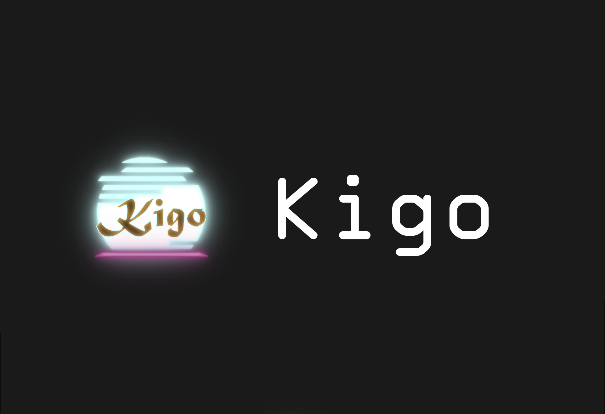
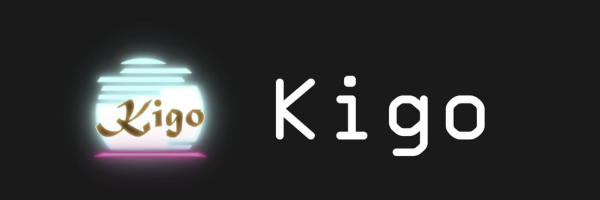
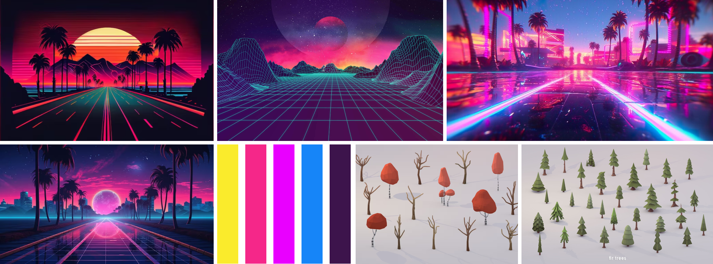
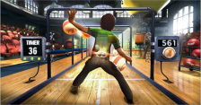
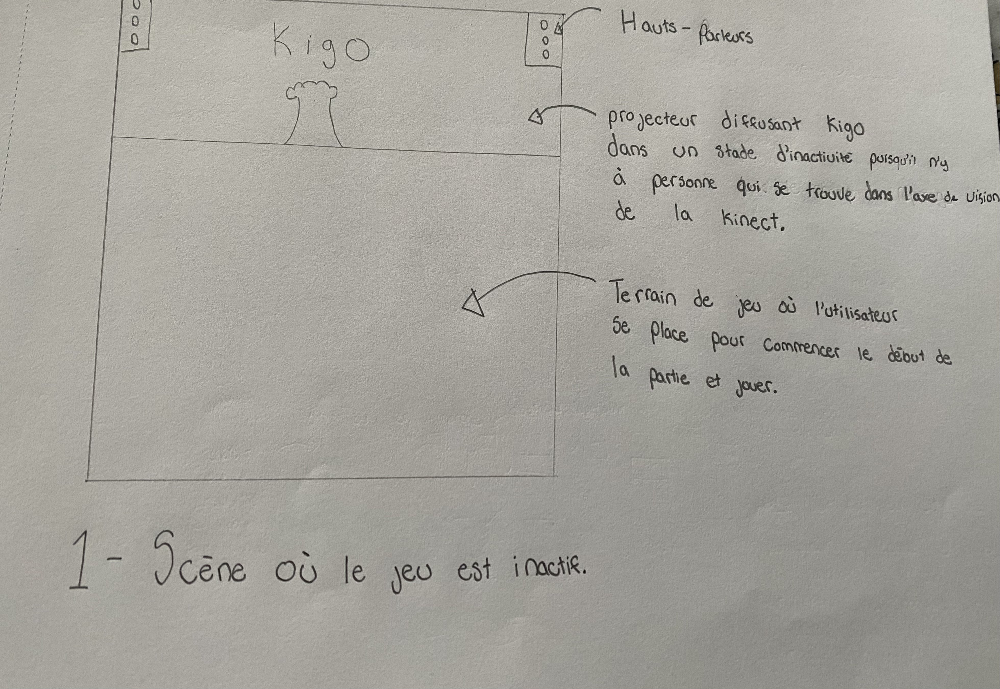
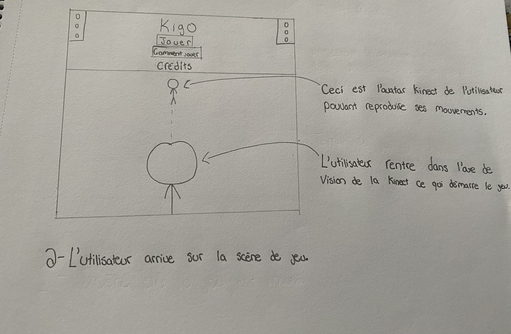
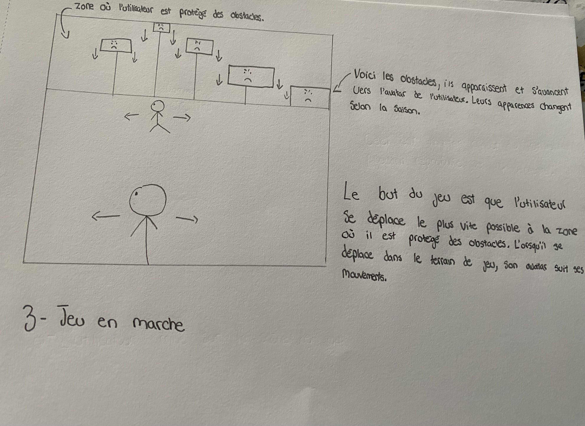
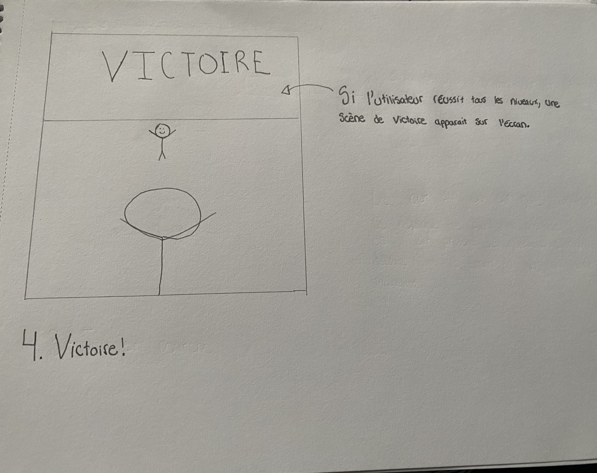
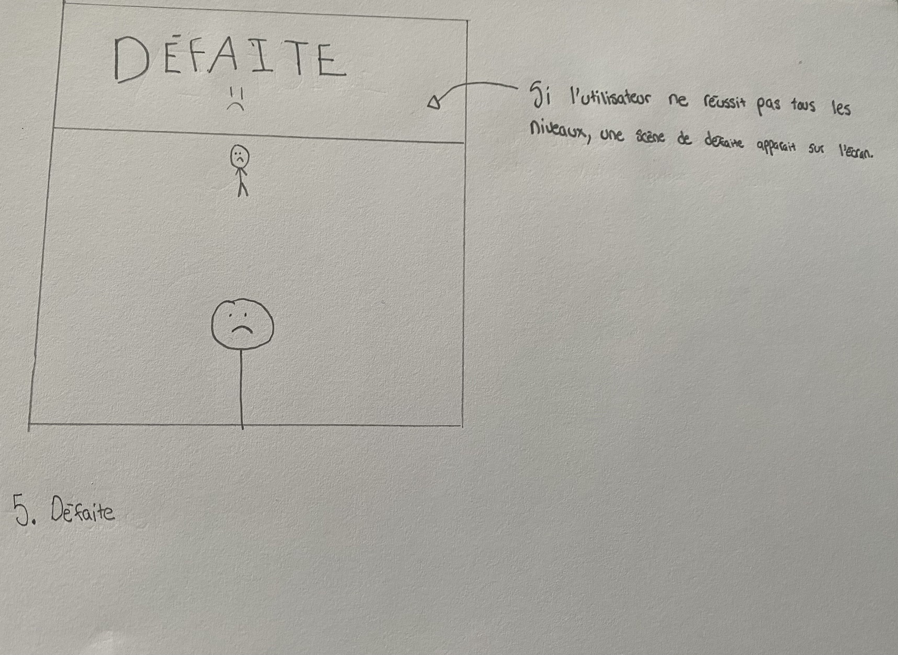

# Préproduction Kigo

## Intention du concept

Démontrer le passage des saisons par un jeu interactif dont les saisons représentent un niveau de difficulté graduelle.

### Synopsis

Dans le cadre du cours, notre équipe présente une expérience multimédia interactice. Cette expérience prendra la forme d'un jeu Kigo qui représente les saisons.
Le but de cette expérience sera de compléter de 4 niveaux de difficultés allant de facile à très difficile. Les décors représenteront les 4 saisons et dont chacune représentera un niveau ainsi que sa difficulté.
L'interaction de ce jeu est possible grâce à la kinect qui captera le mouvement de l'interacteur permettant à l'avatar dans le jeu de bouger à droite ou à gauche et aussi de s'accroupir pour esquiver des obstacles qui viennent vers le joueur.

### Intention de départ

> En temps qu'équipe, notre intention de départ était de faire une expérience multimédia interactive par l'entremise d'un jeu interactif. Ce projet est une occasion de démontrer aux professeurs, au public l'étendue des connaissances acquises durant la technique d'Intégration Multimédia et de leurs applications dans le cadre du projet final de la technique.

### Paragraphe descriptif

Kigo est un projet multimédia interactif où l’interacteur doit esquiver des obstacles virtuels qui se rapproche vers lui dans une thématique des quatre saisons de l’année. L’interacteur doit embarquer sur une plateforme où une Kinect captera ses mouvements. L’avatar du jeu suivra les mouvements de l’interacteur. Les mouvements possibles sont d’aller de gauche à droite et l’accroupissement. L’esthétique du projet sera une projection d’un univers 3d de style néon rétro, qui ressemblera à une route où les obstacles s’avancent vers le joueur. Il y aura des arbres des deux côtés de la route et ceux-ci vont changer à chaque niveau puisque ces niveaux sont basés chacun sur une saison différente. Une musique synthwave jouera pour chaque niveau et sera accompagnée d’ambiances et des bruitages semblables à leur saisons. Le temps de cette expérience est démontré par le fait que chaque niveau se passe dans une différente saison, ce qui fait passer une année. Cette expérience a pour but d’amener de faire ressentir à l’interacteur, de l’engagement et de la détermination pour finir ces niveaux qui deviennent de plus en plus difficiles.

### Cartographie

### Moodboard

Visuel artistique

Sonore

[Ambiance niveau printemps](https://youtu.be/UZ9uyQI3pF0?si=OWN5xIRoZ-BNiwXK&t=1264)

[Ambiance niveau été](https://youtu.be/kW10Xx_Hdto?si=54hkybJjyr6JJFpp&t=2894)

[Ambiance niveau automne](https://youtu.be/aT66uumZ0Zo?si=jfz0KRhrSTcqDlvQ)

[Ambiance niveau hiver](https://youtu.be/5_NgwbEs4JE?si=0kg9LaFzikDOZQNH&t=9474)

[Musique des niveaux](https://youtu.be/k3WkJq478To?si=0_RnxrU8ys0iMwdl&t=5895)

### Références

[Références|Fit it sur steam](https://store.steampowered.com/app/951450/Fit_It/)

[Références|Hole in the Wall](https://www.youtube.com/watch?v=7oIag7dTup0)

[Références|Resident Evil 4 Target Practice inspiration](https://www.youtube.com/watch?v=dxOleXVO4lw&t=44s)

[Références|Guitar zero](https://youtu.be/uMLy1j_6mRQ?si=Yb_qxuwDbr7u-92C)

[Références|Wii fit](https://youtu.be/KFbbjLdmpBQ?si=N8hjS4ezmJU2rfhU)

### Documents

### Scénarimages

  
  
  

## Contenu multimédia à intégrer

- Des paysages différents pour chaque saison.
- Des sons d'ambiances pour chaque saison
- Musique
- Des effets sonores 
  

### Inventaire du contenu multimédia

| Actions du joueur                | Son reliés à L'action |
| -------------------------------- | --------------------- |
| Déplacement à droite ou à gauche | _son à décider_       |
| Accroupir                        | _son à décider_       |

### Univers artistique des éléments

L’esthétique visuelle du projet sera inspiré des arts néons rétro des années 80 et quand chaque saison change, l’apparence visuelle changera pour s’ajuster
à la saison que ce soient les arbres et ses feuilles qui changent de couleurs ou encore les feuilles qui tombent, etc. Chaque niveau aura sa propre musique
inspirée du genre synthwave qui sera bien sûr accompagné des sons d’ambiances différents.

### Espace et ambiance générale du projet

L’espace du projet va ressembler à une sorte de route avec des arbres comme on peut en voir dans des villes comme Miami. Sur cette route, il y aura des obstacles à esquiver. Le joueur s’installera sur une plateforme où il pourra bouger de gauche à droite et s’accroupir. L’ambiance du projet sera engageante et excitante car le jeu testera la capacité du joueur à esquiver des obstacles, ce qui deviendra plus compliqué à chaque niveau complété.

## Planification technique d'un prototype

### Plan technique

### Schéma de branchements

### Équipements requis

- Audio
  - 1 Console de sons
  - 1 Carte de sons
  - 2 Haut-parleurs Genelec 8010APM
  - 4 Câbles XLR (M->F) (Longueur minimale estimée entre 4-6 mètres)
- Vidéo
  - 1 Projecteur
  - 1 Kinect V2
  - 1 sytème d'acrochage pour le projecteur
- Électricité
  - 2 Cordon IEC (pour alimenter les haut-parleurs)
  - 2 Multiprise
  - 2 Extensions de fils électrique (Longueur minimale estimée entre 6-8 mètres)
  - 1 Câble d’alimentation pour ordinateur
  - 1 Câble d’alimentation pour console de son
- Réseau
  - 2 Fils Ethernet (longueur minimale estimée entre 4-8 mètres)
  - 1 HDMI Extender
  - 2 Câbles HDMI
  - Câble displayPort
- Ordinateur
  - 1 Chariot Ordinateur
- Autres
  - Tapis de protection
  - 3 Safety en métal
  - 1 Powercon
  - 1 Magic Arm

### Logiciels requis

- [Kinect studio](https://github.com/Kinect/Docs/blob/master/Kinect4Windows2.0/k4w2/NUI_Tools/Kinect_Studio.md)
- [Unity](https://unity.com/fr)
- [Touch designer](https://derivative.ca/) (Si Unity ne marche pas)
- [Blender](https://www.blender.org/) ou [Maya](https://www.autodesk.com/ca-fr/products/maya/free-trial)
- [OBS Studio](https://obsproject.com/fr)
- [Reaper](https://www.reaper.fm/)

### Ressources humaines requises

- TTP, location des matériaux
- Les membres de l'équipe pour l'installation des projets
- Les participants (le public)
- Guillaume Arsenault
- Thomas Ouellet Fredericks

### Ressources spatiales requise

- Grand Studio
- Captation vidéo
- Projection vidéo sur un mur
- Installation et usage de hauts-paleurs
- Une table
- Un trépied pouvant supporter la kinect
- Un espace pour permettre de mettre des hauts-parleurs

### Contraintes techniques et potentiels problèmes de production

- Avoir des instructions claires pour les participants pour démarrer l'immersion de chaque projet sans l'aide des créateurs du projets.
- Avoir un projet fonctionel sans avoir besoin de la présence des créateurs du projet
- Mettre en place une manière simple et efficace de pouvoir garder les équipements nécessaires pour les projets chargés et prêts à l'utilisation.
- Cable des projets qui pourrait être sur le chemin du public

## Planification de la production d'un prototype (budget et étapes de réalisation)

### Budget prévisionnel

| Budget prévisionnel       | Quantité(s) | Montant($) |
| ------------------------- | ----------- | ---------- |
| Matériaux d'imprimante 3D | 1kg         | 25$        |
|                           |
| **Dépenses totale**       |             | 25$        |
| **Budget total**          |             | 400$       |
| **Budget restant**        |             | 375$       |

### Échéancier global

#### Dates importantes

- Conception et planification : Lundi de la semaine 3
- Maquette(Présentation) : Lundi de la semaine 5
- Documentation(Mise en ligne) : Lundi au vendredi de la semaine 8
- Réalisation et diffusion d'une expérience interactice : Du lundi au vendredi de la semaine 8

### Liste des tâches à réaliser

#### Antoine Dion

- Location des matériaux et équipement requis pour le projet
- Achat si nécessaire de matériaux manquant pour la réalisation du projet
- Installation de l'équipement dans l'espace physique
- Programmation et calibrage de la kinect
- Effectuer des tests avec la kinect
- Vérification et correction de bugs potentiels

#### Érick Ouellette

- Vérification et correction de bugs potentiels
- Installation de l'équipement dans l'espace physique.
- Création de médias 3D
- Création de paysages sonores pour le jeu

#### Nicolas St-Martin

- Installation de l'équipement dans l'espace physique
- Vérification et correction de bugs potentiels
- Création de médias 3D
- Programmation Unity
- Tests et calibrages de l'interactivité dans Unity

#### Gabriel Clerval

- Installation de l'équipement dans l'espace physique
- Vérification et correction de bugs potentiels
- Création de paysages sonores pour le jeu

#### William Rathier Mailly

- Tests et calibrages des hauts-parleurs
- Installation de l'équipement dans l'espace physique
- Programmation et calibrage de la kinect
- Effectuer des tests avec la kinect
- Création de médias 3D (avatar)
- Vérification et correction de bugs potentiels
- Tests et calibrages de VCV Rack avec la console audio, l'ordinateur et les hauts-parleurs

### Rôles et responsabilitées des membres de l'équipe

#### Antoine Dion

- Coordination générale du projet (coordination de l'échéancier, du budget, suivi de la liste des tâches à réaliser, s'assurer de la répartition du rôle et des responsabilités des membres de l'équipe)
- Comité Technique et coordination technique (suivi du devis technique)
- Installation et mise en place de la capture audio-visuelle du projet en temps réel
- Programmation de la kinect

#### Érick Ouellette

- Coordination artistique des paysages visuel
- Coordination artistique 3D

#### Nicholas St-Martin

- Programmeur Unity de l'interactivité
- Coordination artistique 3D
- Créateur artistique Unity

#### Gabriel Clerval

- Coordination artistique des paysages sonores
- Installation des équipements dans le grand studio

#### William Rathier Mailly

- Programmation de la kinect
- Coordination technique

### Moments des rencontres d'équipe

- Lundi 17:10 (1h après le Scrum)
- Mardi 15:20 (1h après la rencontre avec les professeurs)
- Mercredi 14:25 (1h après la rencontre avec les professeurs)
- Jeudi 12:35 (1h après la rencontre avec les professeurs)
- Vendredi ( Rencontre a l'école ou via teams durant le travail autonome)
